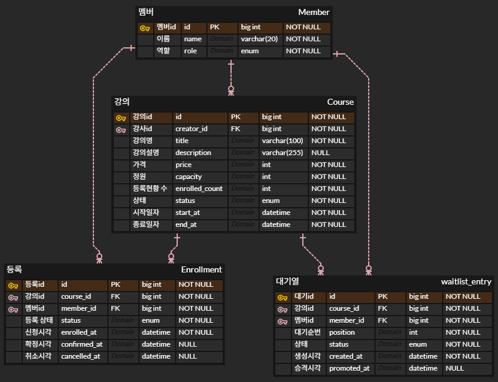

# 수강 신청 시스템 (BE-A)

## 프로젝트 개요

온라인 강의 수강 신청 시스템입니다. 크리에이터가 강의를 개설하고, 수강생의 신청/결제/취소 흐름을 다룹니다. 핵심 과제는 정원 초과 없이 동시 신청을 안전하게 처리하는 **동시성 제어**이며, 비관적 락 기반 구현 후 실제 MySQL 환경에서 동시성 테스트로 검증하였습니다. 정원 마감 시 대기열에 등록하고, 취소로 자리가 나면 자동 승격되는 기능을 포함합니다.

## 기술 스택

- **언어/프레임워크**: Java 21, Spring Boot 3.3.5
- **DB / ORM**: MySQL 8.0, Spring Data JPA (Hibernate)
- **테스트**: JUnit 5, Mockito, Testcontainers
- **빌드/실행**: Gradle, Docker Compose

**JPA를 택한 이유**: Mybatis보다 제게 비교적 친숙하고, 비관적 락을 `@Lock`으로 선언적으로 다룰 수 있어 동시성 제어 의도가 코드에 명확히 드러납니다.

**MySQL을 택한 이유**: H2 인메모리는 비관적 락 동작이 실제 DB와 다를 수 있어, 동시성 검증의 신뢰성을 위해 운영과 동일한 MySQL을 사용했습니다. (동시성 통합 테스트도 Testcontainers로 실제 MySQL에서 수행)

## 실행 방법

```bash
# 1) MySQL 실행 (Docker)
docker compose up -d

# 2) 애플리케이션 실행
./gradlew bootRun
# 또는 IDE에서 EnrollmentApplication 실행
```

- 기본 포트: `8080`
- 인증: `X-Member-Id` 헤더로 사용자 식별 (예: `-H "X-Member-Id: 1"`)
- 스키마는 시작 시 자동 생성됩니다 (개발 `update`, 테스트 `create`).

## 요구사항 해석 및 가정

- **인증/인가**: 과제 허용 범위에 따라 `X-Member-Id` 헤더로 사용자를 식별합니다. 별도 로그인/토큰 인증은 구현하지 않았습니다.
- **취소 가능 기간의 기준 시점**: "결제 후 7일 이내 취소 가능"을 **결제 확정 시각(confirmedAt) 기준**으로 해석했습니다. 결제 전(PENDING) 상태는 기간 제한 없이 취소 가능하도록 했습니다.
- **중복 신청**: 같은 사용자가 같은 강의에 활성 상태(PENDING/CONFIRMED) 신청을 중복 보유할 수 없도록 막았습니다. 단, 취소(CANCELLED) 후 재신청은 허용했습니다.
- **결제 시스템**: 과제 명세대로 실제 결제 연동 없이 상태 변경(PENDING → CONFIRMED)으로 대체했습니다.


### 중요하게 검증한 시나리오

- **마지막 한 자리 동시 신청**: 정원의 마지막 자리에 다수가 동시 신청해도 정확히 정원만큼만 성공해야 함 → 비관적 락으로 보장, 통합 테스트로 검증.
- **취소로 빈 자리에 대기자 자동 승격**: 수강 취소로 자리가 나면 대기 1번이 자동으로 PENDING 신청으로 전환됨.
- **승격 후 미결제 시 다음 사람으로 승계**: 승격된 신청이 결제 기한 내 미결제 시, 스케줄러가 만료시키고 다음 대기자를 승격.
- **취소 기간의 기준 시점**: 과제 문구상 모호한 "결제 후 7일"을, 신청 시점이 아닌 **결제 확정(confirmedAt) 시점** 기준으로 해석하는 것이 비즈니스 의미에 맞다고 판단.

## 설계 결정과 이유

### 1. 정원 동시성 제어 — enrolledCount 카운터 + 비관적 락

동시에 여러 명이 마지막 한 자리에 신청할 때 정원을 초과해선 안됩니다. Course 엔티티에 `enrolledCount` 카운터를 두고, 신청 시 해당 강의 행을 잠근 뒤 정원을 확인/증가시킵니다. 락이 트랜잭션 종료까지 유지되므로 동시 요청은 한 번에 하나씩 직렬화되어, 정확히 정원만큼만 성공합니다.

- **비관적 락 선택 이유**: 인기 강의의 마지막 자리는 충돌이 잦은 상황입니다. 낙관적 락은 충돌이 드물 때 유리하지만, 충돌이 잦으면 버전 충돌로 재시도가 폭증합니다. 충돌이 예상되는 신청 지점에는 비관적 락이 적합합니다.
- **분산락을 사용하지 않은 이유**: 강의별로 락이 분산되고(강의 A·B의 락은 무관) 강의당 동시 신청 규모가 단일 자원 폭주 수준은 아니라 판단했고, DB 비관적 락으로 충분합니다. 트래픽이 임계치를 넘는다면 고려할 수 있을 것 같습니다.
- **검증**: 정원 3명 강의에 10명/100명이 동시 신청하는 통합 테스트(Testcontainers, 실제 MySQL)로 항상 정원만큼만 성공함을 확인했습니다.
### 2. 상태 전이를 enum 화이트리스트로 강제

강의(DRAFT→OPEN→CLOSED)와 신청(PENDING→CONFIRMED→CANCELLED)의 상태 전이를, 서비스에 if를 연발하지 않고 enum에 응집시켜 잘못된 전이를 한곳에서 막습니다. 

### 3. 비즈니스 규칙을 엔티티에 캡슐화

정원 증감(초과 시 예외), 취소 기간 검증을 서비스가 아닌 엔티티 안에 두었습니다. 서비스는 흐름 조율·권한 검증·DTO 변환을 담당하고, 도메인 객체가 자기 불변식을 스스로 보호합니다.

### 4. 커서 기반 페이지네이션

offset 방식 대신 커서(마지막 id 기준)를 사용합니다. offset은 뒤 페이지로 갈수록 느려지고 데이터 변동 시 항목이 밀리지만, 커서는 성능이 일정하고 그 문제가 없습니다. `size + 1`개를 조회해 별도 COUNT 쿼리 없이 다음 페이지 존재를 판단합니다.

### 5. N+1 방지

목록 조회에서 연관 데이터(강의 제목, 수강생 이름)를 항목마다 조회하지 않고, id를 모아 IN 쿼리(`findAllById`)로 한 번에 가져와 Map으로 매핑합니다.

### 6. 대기열 승격은 PENDING 경유

자리가 나면 대기자를 바로 확정하지 않고 PENDING으로 만들어 결제 기한을 부여합니다. "결제 없이 확정"이라는 규칙 위반을 막기 위함입니다. 승격·취소 모두 Course 카운터를 건드리므로 일관되게 비관적 락으로 보호합니다.

### 7. 승격 결제 기한을 WaitlistEntry에 기록

"승격 후 결제 기한"은 일반 신청에 없는 대기열 고유 개념이라, Enrollment가 아닌 WaitlistEntry의 책임(`promotedAt`)으로 두었습니다. 스케줄러는 이를 기준으로 만료를 판단하되, 연결된 신청이 이미 CONFIRMED면 만료시키지 않아 결제한 사람을 잘못 쫓아내는 상황을 방지합니다.

### 8. 설정값 외부화

취소 기간(7일), 승격 결제 기한(24시간), 스케줄러 주기를 `application.yml`로 분리해 코드 수정 없이 변경할 수 있게 했습니다. (과제의 변경 가능성을 설계에 반영에 대한 요구 대응)

## 데이터 모델

4개의 핵심 엔티티로 구성됩니다.

- **Member**: 사용자. 강사(CREATOR)와 수강생(STUDENT)을 별도 테이블로 나누지 않고 `role`로 구분. 한 사람이 강사이면서 다른 강의의 수강생일 수 있기 때문.
- **Course**: 강의. `enrolledCount`(현재 신청 인원 카운터)와 `status`(DRAFT/OPEN/CLOSED) 보유. 정원 동시성 제어의 락 대상.
- **Enrollment**: 수강 신청. `status`(PENDING/CONFIRMED/CANCELLED)와 세 시점(enrolledAt/confirmedAt/cancelledAt) 기록. confirmedAt·cancelledAt은 해당 상태 전엔 null.
- **WaitlistEntry**: 대기열 항목. 순번(position), 상태(WAITING/PROMOTED/EXPIRED), 승격 시각(promotedAt) 보유.

**관계**: Member 1:N Course(강사) · Member 1:N Enrollment · Course 1:N Enrollment · Course 1:N WaitlistEntry · Member 1:N WaitlistEntry

**연관관계 매핑 방침**: JPA 연관관계(@ManyToOne 등) 대신 id 값 참조(courseId, memberId)를 사용했습니다. 도메인 간 결합도를 낮추고 불필요한 지연 로딩·N+1을 원천 차단하기 위함이며, 연관 데이터가 필요하면 명시적으로 조회합니다.

## API 목록 및 예시

상세 명세는 [API_SPEC.md](./API_SPEC.md)를 참고하세요. 주요 엔드포인트 요약:

| 메서드 | 경로 | 설명 |
|---|---|---|
| POST | /api/courses | 강의 등록 |
| PATCH | /api/courses/{id}/status | 강의 상태 변경 |
| GET | /api/courses | 강의 목록 (상태 필터, 페이지네이션) |
| GET | /api/courses/{id} | 강의 상세 |
| GET | /api/courses/{id}/enrollments | 강의별 수강생 목록 (강사 전용) |
| POST | /api/courses/{id}/enrollments | 수강 신청 |
| POST | /api/enrollments/{id}/confirm | 결제 확정 |
| POST | /api/enrollments/{id}/cancel | 수강 취소 |
| GET | /api/enrollments/me | 내 신청 목록 |
| POST | /api/courses/{id}/waitlist | 대기 등록 |
| GET | /api/courses/{id}/waitlist/me | 내 대기 순번 |

### 빠른 시작 시나리오 (복사해서 실행)

```bash
# 1) 강의 등록 (강사 = member 1)
curl -X POST http://localhost:8080/api/courses \
  -H "Content-Type: application/json" -H "X-Member-Id: 1" \
  -d '{"title":"Spring Boot 입문","price":50000,"capacity":30,"startAt":"2025-06-01T00:00:00","endAt":"2025-07-31T23:59:59"}'

# 2) 모집 시작 (DRAFT → OPEN) — 위 응답의 id를 사용
curl -X PATCH http://localhost:8080/api/courses/1/status \
  -H "Content-Type: application/json" -H "X-Member-Id: 1" -d '{"status":"OPEN"}'

# 3) 수강 신청 (수강생 = member 5)
curl -X POST http://localhost:8080/api/courses/1/enrollments -H "X-Member-Id: 5"

# 4) 결제 확정 — 위 응답의 enrollmentId를 사용
curl -X POST http://localhost:8080/api/enrollments/1/confirm -H "X-Member-Id: 5"

# 5) 내 신청 목록
curl "http://localhost:8080/api/enrollments/me" -H "X-Member-Id: 5"
```
주요 기능별 호출 예시를 시나리오별로 [기능별_호출예시.md](./기능별_호출예시.md) 에 추가해놓았습니다.
## 테스트 실행 방법

```bash
./gradlew test
```

- **Docker가 실행 중이어야 합니다.** 동시성 통합 테스트가 Testcontainers로 실제 MySQL 컨테이너를 띄우기 때문입니다.
- 테스트 구성:
  - **도메인 단위 테스트**: 상태 전이, 정원 증감, 취소 기간 검증 등 비즈니스 규칙
  - **서비스 단위 테스트**(Mockito): 중복 신청·권한·대기 승격 등 분기 로직
  - **컨트롤러 테스트**(@WebMvcTest): 요청/응답 매핑, 검증 실패 처리
  - **레포지토리 테스트**(@DataJpaTest): 커서 페이지네이션, 조회 쿼리
  - **동시성 통합 테스트**(Testcontainers): 정원 3명에 10명/100명 동시 신청 시 오버부킹이 없음을 검증

## 미구현 / 제약사항

- **ddl-auto 사용**: 개발 편의를 위해 JPA `ddl-auto`로 스키마를 자동 생성합니다(개발 update, 테스트 create). 운영에서는 `validate` + Flyway/Liquibase로 전환해야 합니다.
- **인증/인가 간소화**: `X-Member-Id` 헤더 방식이라 실제 보안은 없습니다. 운영에서는 JWT/OAuth2 등으로 대체가 필요합니다.
- **대기 순번의 구멍**: 중간 대기자가 승격/만료되면 순번에 빈 번호가 생길 수 있으나, 승격은 항상 position 최소값을 선택하므로 동작에는 영향이 없습니다.
- **취소 시 Course 락 재진입**: cancel에서 Course 락을 건 뒤 승격 로직에서 같은 Course를 다시 조회합니다. 같은 트랜잭션이라 안전하지만, course 객체를 전달하는 방식으로 리팩토링할 여지가 있습니다.
- **잘못된 path variable 처리**: 숫자가 아닌 경로 변수는 현재 500으로 처리됩니다. 타입 불일치 예외를 400으로 변환하는 핸들러를 추가하면 개선됩니다.
- **스케줄러의 다중 인스턴스 한계**: 현재 스케줄러는 단일 인스턴스를 가정합니다. 여러 인스턴스로 확장 시 중복 실행을 막아야 합니다.

## AI 활용 범위

설계와 구현 과정에서 AI를 페어 프로그래밍 파트너로 활용했습니다. 설계 방향 논의, 코드 초안 작성, 트레이드오프 검토, 디버깅에 활용했습니다. 코드작성과 문서화, 트레이드 오프 장단점 고민에 많은 도움을 받은듯합니다. 다만 기술 선택(비관적 락, 커서 페이지네이션, 대기열 승격 구조 등)은 직접 이해하고 판단하였습니다. 동시성/대기열 등 핵심 동작을 포함한 모든 테스트를 작성/실행해 검증했습니다(Testcontainers 드라이버 설정 충돌을 함께 디버깅하여 해결). 
